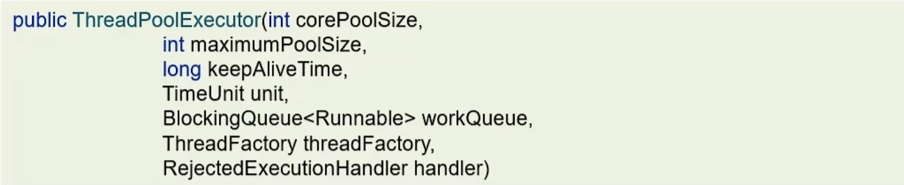
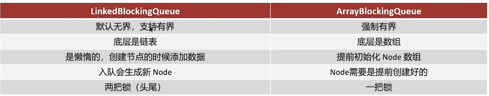
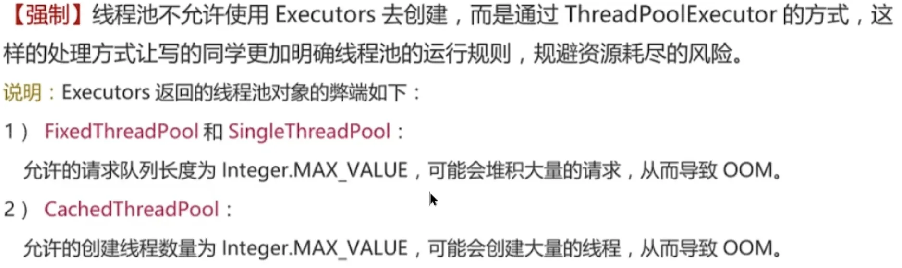
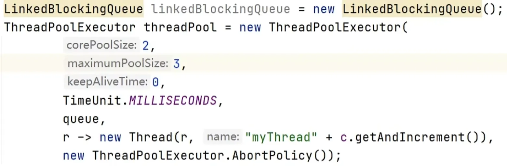
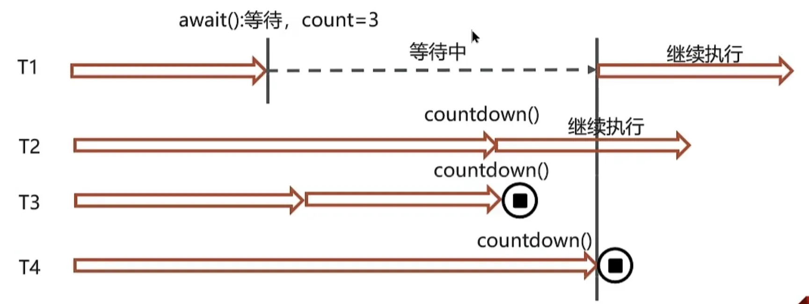
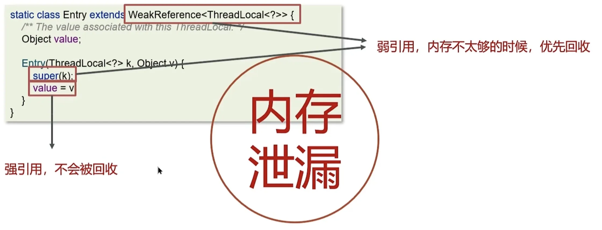

# 一.线程池的核心参数（执行原理）
## 1.线程池核心参数

- `corePoolSize`核心线程数
- `maximumPoolSize`最大线程数 = 核心线程数 + 非核心线程数
- `keepAliveTime`生存时间，当非核心线程在生存时间内没有新任务，那么线程资源会被释放
- `unit`时间单位，非核心线程的生存时间单位
- `workQueue`工作队列，当没有空闲的核心线程时，新的任务会加到此队列，满了之后开始创建非核心线程
- `threadFactory`线程工厂，可以定制线程对象的创建，比如起名字，是否为守护线程
- `handler`拒绝策略，当所有线程都在繁忙时，且`workQueue`也满了，会触发拒绝策略
## 2.线程池拒绝策略
- `AbortPolicy`直接抛出异常，默认
- `CallerRunsPolicy`用调用者所在线程执行任务
- `DiscardOldestPolicy`丢弃阻塞队列中最靠前的任务，并执行当前任务
- `DiscardPolicy`直接丢弃任务
## 3.线程池有哪些常见的阻塞队列
- `ArrayBlockingQueue`基于数组结构的（强制有界）阻塞队列，FIFO
- `LinkedBlockingQueue`基于链表结构的（默认无界，支持有界）阻塞队列，FIFO
- `DelayedWorkQueue`一种优先级队列，可以设置执行时间，执行时间靠前的先执行
- `SynchronousQueue`不存储元素的队列，每次插入都必须等待一次移出操作
`ArrayBlockingQueue`和`LinkedBlockingQueue`的区别：

## 4.如何确定核心线程数
- IO密集型任务：文件读写，DB读写，网络请求
	- 核心线程数为2N+1
- CPU密集型任务：计算型代码，Bitmap转换，Gson转换
	- 或者 高并发，执行任务短，减少CPU上下文切换
	- 核心线程数为N+1
## 5.线程池的种类有哪些
1，`FixedThreadPool`固定线程数的线程池
- 核心线程数和最大线程数一样，没有非核心线程
- 阻塞队列是`LinkedBlockingQueue`，最大容量为`Integer.MAX_VALUE`
- 适用于任务量已知，相对耗时的任务。
2，`SingleThreadExecutor`单线程化的线程池，只会使用唯一的工作线程来执行任务，保证所有任务都按指定顺序FIFO执行
- 核心线程数和最大线程数都是1
- 阻塞队列是`LinkedBlockingQueue`，最大容量为`Integer.MAX_VALUE`
- 适用于按照顺序执行的任务
3，`CachedThreadPol`可缓存线程池
- 核心线程数为0
- 最大线程数是`Integer.MAX_VALUE`
- 阻塞队列为`SynchronousQueue`，不存储元素的阻塞队列，每个插入操作都必须等带有一个移出操作
- 适合任务数比较密集，但是每个任务执行时间比较短的情况
4，`ScheduledThreadPool`提供了“延迟”和“周期执行”功能的ThreadPoolExecutor。
## 6.为什么不建议使用Executors创建？

因为`Executors`创建的都是无界队列或者无限制的线程，那么堆积的任务或者线程多了之后，可能会导致OOM，所以使用`ThreadPoolExecutor`来明确每个参数是什么。

# 二.线程池使用场景
## 1.CountDownLatch
`CountDownLatch`，闭锁/倒计时锁，用来进行线程同步协作，等待所有线程完成倒计时（一个线程或者多个线程等待其他多个线程完成某件事情后，才能继续执行）。
- 构造参数初始化等待计数值
- `await()`用来等待计数归零
- `countDown()`用来让计数减一

## 2.数据汇总
实际开发的过程中，可能需要从多个接口拿到结果，如果我们串行执行，那么等待时间可能比较长，如果这些接口没有依赖关系，那么我们使用线程池+future来提升性能。
## 3.异步调用
在方法上加上`@Async(线程池名称)`，在启动类加上`@EnableAsync`开启异步调用。
为了避免下一级方法影响上一级方法（性能），可以使用异步线程调用下一个方法（不需要下一级的返回值），可以提升方法响应时间。
## 4.Semaphore 限制方法执行的线程数量
`Semaphore`一种信号量，`juc`包下的一个工具类，底层使用AQS，可以通过它来限制方法执行的线程数量。
- 创建`Semaphore`对象，可以给一个容量
- 调用`semaphore.aquire()`来获取一个信号量，此时信号量-1。当信号量为0的时候，会阻塞，直到其他线程释放了信号量。
- 调用`semaphore.release()`，释放一个信号量，此时信号量+1。
## 5.聊聊 ThreadLocal
1. Thread 类对象中 维护了 ThreadLocalMap 成员变量
2. ThreadLocalMap 类对象中 维护了 Entry 数组，Entry数组中的每一个元素都是一个Entry对象
	1. 每个Entry对象中存储着 一个ThreadLocal对象与其要存入的数据value值
	2. `每个Entry对象在Entry数组中的位置是通过ThreadLocal对象的threadLocalHashCode计算出来的，以此来快速定位Entry对象在Entry数组中的位置`
3. 所以，在Thread中，可以存储多个ThreadLocal对象
	- `set(value)`设置值
		- 获取当前线程，获取当前线程的ThreadLocalMap，调用其set方法，存入的 key 是this(即ThreadLocal对象本身)，value是要存入的数据。
	- `get()`获取值
		- 根据线程对象，来获取对应的`ThreadLocalMap`，调用其get方法，通过this(即ThreadLocal对象本身) 获取到之前存入的数据，从而获取对应的`Entry`对象，拿到值。
	- `remove()`清除值
		- 根据 哈希值 与 容量减一 进行 位与运算 拿到对应的下标位置，然后删除。
`ThreadLocal`本质是一个线程内部存储类，从而让多个线程只操作自己内部的值，从而实现线程数据隔离。每个线程内部都有一个`ThreadLocalMap`对象，里面存了一个叫`table`的`Entry`数组（存储数据）。

_**内存泄漏问题**_

每个`ThreadLocal`维护一个`ThreadLocalMap`，在`ThreadLocalMap`的`Entry`对象继承了`WeakReference`。其中`key`为使用弱引用的`ThreadLocal`实例，`value`为线程变量的副本。
`key`是弱引用，值为强引用。`key`会被`GC`释放，但关联的`value`不会。
- 对于自己创建的线程，由于线程执行结束后被销毁，其内部的`ThreadLocal`和`ThreadLocalMap`不再被强引用，于是可以被gc回收。
- 对于线程池使用`ThreadLocal`，由于线程会反复使用，它的`key`是弱引用，而对应的`value`是强引用，当key被gc回收后，value却不能被回收，也无法抵达，那么造成了内存泄漏问题。
- 所以直接在最后使用`remove()`方法清理掉，避免内存泄漏。
