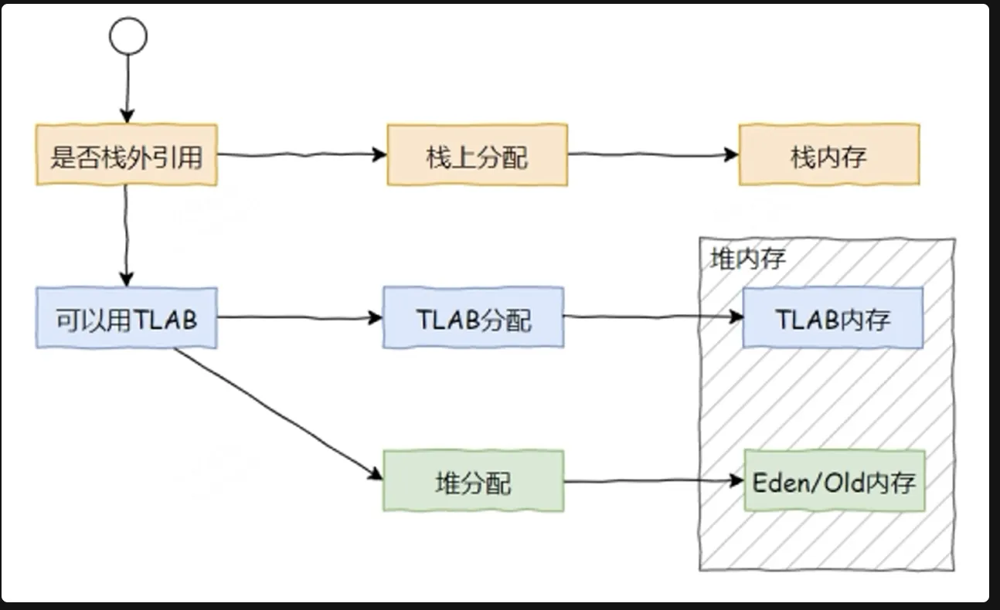

# 一.对象
## 1.创建对象一定分配在堆里吗？

_**1，逃逸分析和栈上分析**_
+ 逃逸分析：JVM通过分析对象的动态作用域，判断对象是否可能逃逸出当前方法或当前线程：
    - 未逃逸：对象仅在方法内部使用，不会被外部方法或线程访问。
    - 方法逃逸：对象作为返回值或参数传递到其他方法。
    - 线程逃逸：对象能被其他线程访问（如赋值给静态变量）。
+ 栈上分析：如果对象未逃逸，JVM可能把它分配到栈帧中，跟随方法结束自动销毁，避免堆内存分配，减少GC压力。
_**2，如果本线程的TLAB区域未满，则优先分配到TLAB区域**_
TLAB：多线程同时new对象时，为了防止内存重复分配，需要互斥锁，但又降低了内存分配速度，因此引入TLAB，`Thread Local Allocate Buffer`，可以直接在里面分配内存，不需要加锁，适用于小对象。
_**3，对象分配在堆中**_

## 2.JVM层面，创建对象如何分配内存？
1. 检查类加载状态：是否已经加载，链接，初始化
2. 分配内存：在堆中划分内存，方式有**指针碰撞**（堆规整）和**空闲列表**（堆不规则）
3. 初始化零值：将对象的信息（**不含对象头**）置零
4. 设置对象头：**记录哈希码，GC分代年龄，锁状态信息，类型指针**等
5. 执行`<init>`方法：按构造函数初始化

# 二.类
## 1.类的生命周期
类的生命周期主要包括五个阶段：加载，链接（验证，准备，解析），初始化，使用，卸载。
1. 加载
    - `jvm`将类的**二进制字节码**文件读取到内存，来源可以是本地文件，网络等，在方法区生成该类运行时的数据结构（如类元信息，常量池等），然后在堆中创建一个`Class`对象作为访问入口。
    - 触发条件：**类的首次主动使用**（比如**new**实例，调用**静态**方法，访问**静态**字段，**反射**调用等）。
    - 关键点：被动引用不会触发加载，比如**通过子类访问父类的静态字段**。
2. 链接
    1. 验证
        * 确保字节码**符合jvm规范**，防止恶意代码**破坏虚拟机**。
        * 语义验证（语法，继承关系，`final`规则）。
        * 符号引用验证（确保后续解析能够正常完成）。
    2. 准备
        * 为类变量（static）**赋初始值，零值**。
        * 如果是`static final`修饰的**基本数据类型，那么可以直接赋值**。
        * 如果是`static final`修饰的**字符串常量，也可以直接赋值**。
        * 对于其他的引用数据类型，那么需要到**初始化阶段**才能赋值。
    3. 解析
        * 将常量池中的符号引用（符号化的类，方法，字段名称）替换为直接引用（内存地址或句柄）。
3. 初始化
    - 执行类构造器的初始化方法，完成类变量的赋值和静态代码块的执行。
    - 触发条件：类的主动使用，保证父类已经初始化。
    - jvm保证多线程初始化的安全性，即只初始化一次。
    - 被动引用不会触发初始化
        * 比如通过子类引用父类的静态字段（仅初始化父类）。
        * 通过数组定义引用类。
        * 访问类的`static final`常量，因为已经在准备阶段完成赋值。
4. 使用
    - 类完成初始化后，进入可用状态。
        * 创建对象实例
        * 访问具体字段或方法
        * 反射调用类的方法或构造器
5. 卸载
    - 触发条件有三条
        * 该类的实例对象已被GC回收
        * 该类的Class对象没有被任何地方引用（如反射，静态变量）
        * 该类的类加载器已被回收

# 三.双亲委派机制
## 1.类加载器
类加载器的作用就是将 字节码文件 加载到 JVM 内存中
**Bootstrap ClassLoader 启动类加载器**
+ 加载 JAVA_HOME/jre/lib 下的类
+ 无法直接访问，由C/C++实现
**Extension ClassLoader 扩展类加载器**
+ 加载 JAVA_HOME/jre/lib/ext 下的类
+ 上级为 Bootstrap 
**Application ClassLoader 应用程序类加载器**
+ 加载 classpath 目录（就是我们平时代码的目录）下的类
+ 上级为 Extension 
**自定义类加载器**
+ 可以实现自定义的类加载规则：通过自定义类加载器，可以绕过/破坏双亲委派（例如优先自己加载类），实现**类隔离**或**多版本共存**。
+ 上级为 Application
## 2.双亲委派机制 及其 好处
双亲委派 指明了 加载类时 类加载器的行为
**双亲委派模型的工作过程**：如果一个类加载器收到了类加载的请求它首先不会自己去尝试加载这个类，而是把这个请求委派给父类加载器去完成，每一个层次的类加载器都是如此，因此所有的加载请求最终都应该传送到顶层的启动类加载器中，只有当父加载器反馈自己无法完成这个加载请求(它的搜索范围中没有找到所需的类)时，子加载器才会尝试自己去加载。
（注意类加载器的父子关系不是以继承的方式实现，而是组合）
可以保证
+ 类的唯一性：通过双亲委派机制可以避免某一个类被重复加载，当父加载器已经加载后则无需重复加载
+ 类的安全性：防止用户自定义类覆盖核心类，保证核心类不会被修改
## 3.破坏双亲委派
_**如何破坏？**_
双亲委派模型对于保证Java程序的稳定很重要，但实现却很简单，实现双亲委派的代码都集中在java.lang.ClassLoader的loadClass()方法之中
`解释： 原来的loadClass()方法之中的逻辑是：先检查类是否已经被加载过，若没有加载则调用父加载器的loadClass()方法，若父加载器为空则默认使用启动类加载器作为父加载器。如果父类加载失败，抛出ClassNotFoundException异常后，再调用自己的findClass()方法进行加载。`
因此要破坏双亲委派模型，只需要自定义类加载器，并且重写loadClass方法，且内部逻辑不遵循双亲委派
_**经典案例：Tomcat 破坏双亲委派**_
- 原因：一个 Tomcat，是可以同时运行多个Web应用程序的，而不同的应用可能会同时依赖一些相同的类库，但是它们使用的版本可能是不同的，但这些类库中的Class的全路径名是一样的，如果都采用双亲委派的机制的话，是无法重复加载同一个类的。
- 解决方案：所以在Tomcat中，每个应用都由一个独立的 WebappClassLoader (Tomcat自定义的类加载器) 进行加载，内部逻辑：针对私有类不遵循双亲委派，而是自己加载，即各自加载各自需要的类(版本不同，全类名相同)，即使全类名相同，JVM 也会视为不同类（因类加载器不同），所以不同Web应用程序中的类可以使用相同的类名
- 因为每个Web应用都是用 WebAppClassLoader 独自加载的，但是如果有一个公共的jar包，比如Spring，各个应用的版本都一样，那么岂不是要重复加载很多次了？
- Tomcat 给了个方案，那就是 SharedClassLoader，我们可以指定一个目录，让SharedClassLoader来加载，他加载的类在各个Web应用中都是可以共享使用的，避免重复加载，节省内存。

