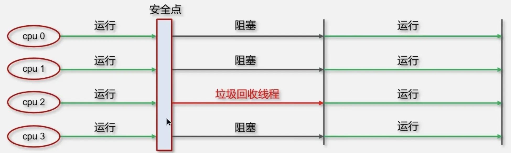
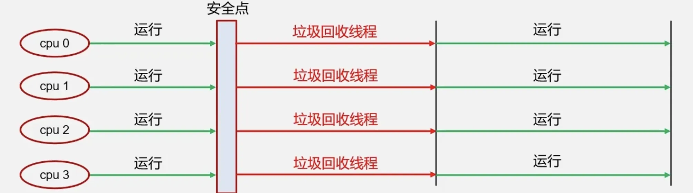
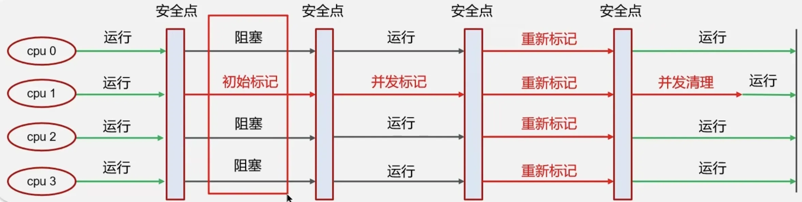

# 一.关于垃圾回收
_**请你聊聊 Java 的 GC 垃圾回收**_
1. **什么是垃圾？**
	早期我们使用引用计数法来判断对象是否是垃圾，但发现它存在循环引用导致内存泄漏的问题，所以我们现在都是采用根可达性算法，去判断对象是否是垃圾。
2. **垃圾回收算法**
垃圾回收算法有三种，分别是标记清除、标记整理、复制。
- 标记清除算法 优点是垃圾回收速度快，缺点是会产生内存碎片，造成内存浪费和溢出
- 标记整理算法 优点是不会产生内存碎片，缺点是效率较低，整理涉及到对象的移动较复杂
- 复制算法 优点是不会产生内存碎片，且较为高效，缺点是占用双倍的内存空间（内存空间开销大）
3. **分代垃圾回收**
	但我们一般不单独使用某一种垃圾回收算法，由于对象的生命周期是不同的，有的产生后很快可以回收，有的会存活很久，对象的差异化决定了我们要差异化管理它们，所以我们通常把堆分成年轻代和老年代，年轻代中存储的是朝生夕死的对象，因此它们是会频繁发生GC回收的，所以年轻代一般采用的是复制算法，而老年代中存储的是生命周期很长的对象，因此它们很久才会发生GC回收一次，所以老年代一般采用标记整理算法。
4. **垃圾回收器**
	例如 CMS，CMS 是针对老年代的、追求响应时间优先的垃圾回收器，主要在两方面实现，第一，CMS采用的是标记清除算法，优点就是速度快，第二，在CMS的垃圾回收过程中，在一些阶段（并发标记和并发清理）中是允许用户线程和垃圾回收线程同时工作的，通过这两点来达到响应时间优先。
	又例如G1，G1是一个全年代的、可设置每次垃圾回收STW的暂停时间目标的垃圾回收器，例如一次STW的时间不能超过200ms，它的实现原理要从结构讲起，G1把堆内存划分为若干个大小相同的区，每个区都会产生垃圾，但在垃圾回收时，可以选择性的回收垃圾较多的区域，垃圾较少的区域暂时不回收，这样效益较高，短时间内回收了尽可能多的垃圾，尽可能达到STW的暂停时间目标。
5. **GC 调优**
	我们有时候根据场景可以通过替换垃圾回收器，来进行GC调优，JDK8的默认垃圾回收器是 Parallel GC（并行垃圾回收器），例如系统要求低延迟低停顿，我们可以更换垃圾回收器为CMS，如果我们的系统有着超大堆内存空间且注重可预测停顿STW时间的话，可以更换垃圾回收器为G1。根据系统特性来进行选择。
	另外像Java本身他也一直在优化GC，例如JDK7到JDK8的一个变化是把方法区的实现从堆内存移到了本地内存，是因为方法区存储的是类的元信息，而随着动态加载类的技术发展，我们运行时也会加载很多类，所以方法区所占有的内存大小变得不可预知，为了防止它对堆内存的GC影响，所以把它从堆中移动出来。（JDK7永久代大小固定，JDK8元空间大小自动调整）
	还有比如逃逸分析和栈上分配也是为了减轻GC压力。
# 二.判断是否为垃圾
## 1.根可达性算法
首先要找出一系列的 GC Root 根对象，以GC Root为起点，沿着引用链进行查找，能找到的对象即不可回收，不在GC Root 引用链上的对象即可视为垃圾。
**哪些对象可以作为GC Root？四类如下：**
1. 系统类的实例对象
2. 本地方法调用相关的实例对象
3. 当前活动线程相关的实例对象
4. 被加锁的实例对象
## 2.三色标记法
_**背景**_
	根可达性算法是理论基础，定义了“如何判断对象存活”的规则
	三色标记法是实现手段，是实现上述规则的高效遍历算法
_**定义**_
	三色标记法是一种**对象遍历和标记算法**，用于在垃圾回收过程中区分存活对象和垃圾对象
_**原因**_
	正常的标记过程，应该是需要STW的，对象的引用关系是不会变化的，才能标记正确
	但是这个标记过程需要消耗时间，可能导致STW的时间很长。
	因此为了减少STW的时间，才出现了三色标记法，它允许并发标记，允许用户线程工作
_**好处**_
	核心价值在于**高效遍历对象图**，同时支持**与用户线程并发执行**，减少垃圾回收的停顿时间（STW）
### 2.1.工作流程
它将内存中的对象标记为三种颜色：
+ **白色**：该对象没有被标记过
+ **灰色**：该对象已经被标记过了，但该对象的引用对象还没标记完
+ **黑色**：该对象已经被标记过了，并且他的全部引用对象也都标记完了
**初始标记(STW)**：遍历所有的 GCRoot 根对象，将根对象和直接引用的对象标记为灰色，不会扫描整个堆。因此，初始标记阶段的时间比较短。
**并发标记(不需要STW)**：在这个过程中，垃圾回收器会从灰色对象开始遍历，将灰色对象引用的所有白色对象标记为灰色，然后将该灰色对象标记为黑色，不断重复，直到没有更多的灰色对象。并发标记过程中，应用程序线程可能会修改对象图，因此垃圾回收器需要使用写屏障技术来跟踪引用变更。
**重新标记(STW**)：重新标记的主要作用是处理并发阶段变更的引用。
### 2.2.漏标
**只有当两个条件同时满足时**：
1. **黑色对象新增到白色对象的引用**（条件1）：黑色对象已经完成扫描，不会再次被处理。
2. **灰色对象到白色对象的所有路径被切断**（条件2）：白色对象不再被任何灰色对象引用，无法通过灰色对象被标记。
或者理解为：
`并发标记时，扫描过程中插入了一条或多条从黑色对象到白色对象的新引用，并且去掉了灰色对象到该白色对象的直接引用或者间接引用。`
+ **结果**：白色对象无法被标记为存活，导致漏标（被错误回收）。
`这里本质上是需要满足两个条件，单独一个条件发生不会引发问题。所以解决方案中的核心思想先记录下这两者之一条件，再去重新判断。`
_**解决方案**_
+ **CMS 采用 "增量更新" 解决**
    - 并发标记过程中，当新插入黑色对象指向白色对象的引用时，把该引用关系记录下来
    - 重新标记过程中，根据新增的引用关系，重新进行判断白色对象
+ **G1 采用 "原始快照" 解决**
    - 并发标记过程中，当删除灰色对象指向白色对象的直接/间接引用时，把该引用关系记录下来
    - 最终标记过程中，根据删除的引用关系，重新进行判断白色对象
# 三.垃圾回收器
## 1.串行垃圾回收器
Serial 和 Serial Old串行垃圾回收器，是指利用单线程进行垃圾回收，堆内存较小，适合个人电脑。
+ Serial 作用于新生代，采用复制算法。
+ Serial Old 作用域老年代，采用标记-整理算法。
垃圾回收时，只有一个线程在工作，并且java应用中所有线程都要暂停（STW），等待垃圾回收的完成。
<!-- 这是一张图片，ocr 内容为： -->

## 2.并行垃圾回收器
Parallel New 和 Parallel Old 是一个并行的垃圾回收器，JDK8默认使用此垃圾回收器。
+ Parallel New 作用于新生代，采用复制算法
+ Parallel Old 作用于老年代，采用标记0整理算法
垃圾回收时，多个线程在工作，并且java应用中所有线程都要暂停（STW），等待垃圾回收的完成。

## 3.CMS 并发垃圾回收器
一种 并发的，针对老年代垃圾回收的垃圾回收器，使用标记-清除算法，停顿时间短，用户体验好，在垃圾回收的时候，应用仍然能够正常运行。

## 3.G1 垃圾回收器
+ 作用于新生代和老年代，在** JDK9 之后默认使用G1**。
+ 划分多个区域 Region，每个区域都可以充当 eden，survivor，old，humongous（存放大对象）。分区取代分代，支持灵活的回收策略。
+ 采用复制算法（没有内存碎片）。
+ 响应时间于吞吐量兼顾。
+ 如果并发失败（回收速度赶不上创建对象速度），会触发 Full GC。

G1 的一个特点是 可以设置每次垃圾回收STW的暂停时间目标，比如STW的时间不能超过200ms
实现原理：这要结合 G1 把堆内存划分为若干个大小相同的区来看，每个区都会产生垃圾，当 G1 进行回收时，可以仅仅选择回收部分垃圾较多的区域，垃圾较少的区域暂时不回收，第一，范围缩小了，节省了时间，第二，也回收了相对多的垃圾，由此去使得STW的时间接近设定的暂停时间目标。
G1 回收的详细过程（三色标记法
1. **初始标记**（需 STW）：标记 GC Roots 直接关联的对象
2. **并发标记（与用户线程并发执行）：从初始标记阶段标记的对象出发，遍历整个对象图，标记所有可达的对象
3. **最终标记**（需 STW）：由于并发标记阶段允许用户线程工作，可能会有些对象的引用关系变化，导致漏标(对象消失)。重新标记阶段需要再次STW，处理这些在并发标记期间变化的对象，确保标记的准确性。
4. **混合回收**（需 STW）：制定回收计划，选择新生代，老年代，大对象中的部分Region进行垃圾回收（复制存活对象到空Region，清空原 Region），达到暂停时间的目标
G1 适用于拥有超大堆内存、高吞吐量、低延迟、可预测暂停时间目标的系统
# 四.四种引用
+ 强引用：只有所有GC Root对象都不通过 强引用 引用该对象，该对象才能被回收。
+ 软引用：仅有软引用引用该对象时，当触发垃圾回收后，内存仍不足时该对象就会被回收。
+ 弱引用：仅有弱引用引用该对象时，在垃圾回收时，无论内存是否充足，都会回收。
+ 虚引用：必须配合引用队列使用，被引用对象回收时，会将虚引用入队，由 `Reference Handler`线程调用虚引用相关方法释放直接内存。