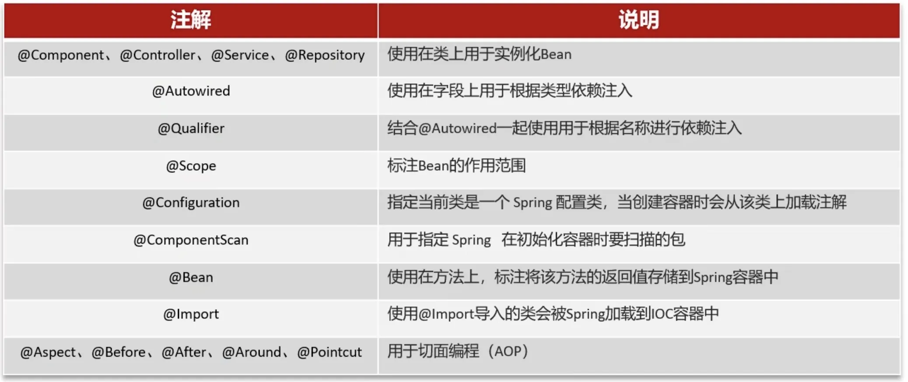
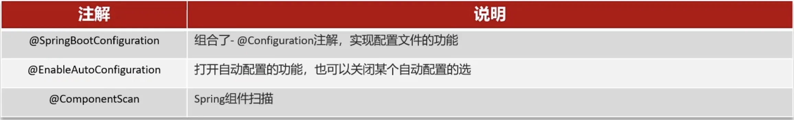
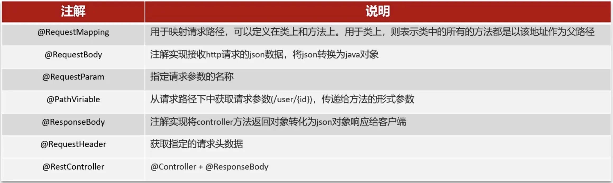
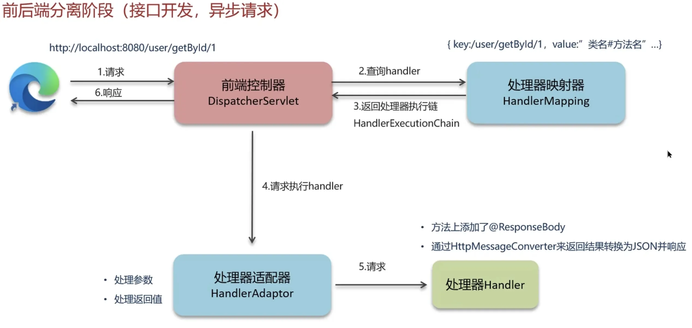

# 一.常见注解
## 1.Autowired和Resource的区别
这两个注解都是实现依赖注入的，告诉Spring在创建Bean的时候，自动注入相关依赖。
不同点如下：
- 匹配顺序不同
	- `Autowired`是先`ByType`再`ByName`。
	- `Resource`是先`ByName`再`ByType`。
- 作用域不同
	- `Autowired`可以用在构造器，字段，Setter方法上。
	- `Resource`只可以用在字段，Setter方法上，不支持构造器注入。
- 支持方不同
	- `Autowired`是Spring提供的自动注入注解，只有Spring支持。
	- `Resource`是JDK提供的自动注入注解，等于一个标准，所有的IOC容器都支持这个注解。

## 2.Spring系列相关注解

# 二.Bean
## 1.Bean的生命周期
Spring容器在实例化时，会将xml配置的bean的信息封装成一个BeanDefinition对象，Spring根据BeanDefinition来创建Bean对象。
- 通过**xml配置的bean信息**封装为**BeanDefinition**
- 然后使用空参构造构造出一个**空白的Bean**
- 然后根据**注解或者xml**将属性注入进来
- 然后Aware接口负责告诉**Bean底层的资源，包括名字和环境，工厂**
- `postProcessBeforeInitialization`：在初始化方法（如 `@PostConstruct`）执行**前**调用
- 然后进行初始化
- `postProcessAfterInitialization`：在初始化方法执行**后**调用。**（极其关键：Spring AOP 动态代理的生成，就是在这个方法里完成的！原来那个原始的 Bean 会被偷偷替换成一个代理对象暴露出去）**
- 结束后就销毁bean

## 2.Bean的循环依赖
在实例化A的过程中，依赖了B，但是B没有被实例化，不在容器中，所以需要实例化B，这时A也不在容器中，然后实例化B，发现A没有实例化，所以又去实例化A，造成了**循环依赖**。

Spring通过**三级缓存**解决循环依赖问题：
1. 一级缓存：**单例池**，存放**已经经历了完整生命周期**的Bean，已经初始化完毕的Bean。
2. 二级缓存：缓存**早期的Bean**对象（生命周期还未走完）。
3. 三级缓存：缓存的是ObjectFactory，**对象工厂**。
比如二级缓存就是将**半成品A放到二级缓存**，然后初始化B的时候将半成品A给它，从而初始化B，进而初始化A。
工厂则是初始化A，生成它的工厂放到三级缓存，如果需要B，则实例化B，同时将B的工厂放到三级缓存，B这时如果需要A，则从三级缓存拿到A的工厂，然后生成半成品A放入二级缓存，B从二级缓存拿到A，然后注入，B创建成功后放入一级缓存，二级缓存中的A再拿到一级缓存中的B完成自己的初始化。

## 3.Bean的作用域
- 单例：IOC容器只有一个域，每次获取的是同一个对象
- 多例：每次获取都会新建一个对象
- Request：每次http请求都生成一个Bean，仅在当前请求内有效
- Session：每个session都生成一个Bean，仅在当前session内有效
- application：每个web应用在启动时创建一个，仅在当前应用启动时间内有效
- websocket：每个websocket会话生成一个新的bean

# 三.AOP
## 1.SpringAOP实现原理
springaop将**关注点（日志，事务，安全等）与业务逻辑分开**，提高模块化。允许开发者在不修改源代码的情况下，**对业务方法进行增强**。
Aop的实现原理如下：
- 当目标类继承了至少一个接口的时候，使用**jdk动态代理**，生成一个**实现相同接口的代理类**，通过`InvocationHandler`拦截方法调用，并织入增强逻辑。
	- 正因为代理对象是基于接口生成的，它**只能拿到、也只能代理接口中定义的方法**。 Spring Boot 从 2.0 版本开始，默认将 AOP 的代理方式**全部切换为了 CGLIB。**
- 当目标类没有实现接口，spring使用**cglib动态代理**，生成一个目标类的子类，通过重写方法实现增强。cglib在运行时动态生成字节码，效率较高，但**无法对`final`方法进行代理**。

# 四.事务
Spring默认回滚**非检查型异常（比如空指针或者数组越界）和Error**，对于CheckedExecption（**检查型异常**，比如IO异常，sql异常）是**不会回滚的**，这时需要我们手动指定：`@Transactional(rollbackFor = Exception.class)`来主动触发事务回滚。至于要不要自己`catch`，取决于业务。实际上我们需要在`catch`块中手动去处理这些异常，比如记录日志，或者通知MQ，那么在`catch`块处理结束后，我么**必须手动抛出，才能触发AOP回滚**；又或者我们手动调用事务管理器来手动标记回滚（不是触发， 把内部的 `rollbackOnly` 属性设置为了 `true`）。
又或者在出现异常后直接catch了但不抛出，那么也不会触发回滚。

## 1.Spring事务失效场景
- 异常`catch`捕获后，没有进行抛出。必须手动抛出。
- 捕获的是检查型异常。将`rollbackFor`改为`Exception.class`。
- 非`public`方法导致事务失效spring默认对`public`增强。改为`public`。
- `final`或`static`修饰的方法：AOP是通过代理对象来实现的，无法对`final`方法进行子类化或者覆盖，所以无法拦截，`static`方法属于这个类，而不是对象，无法被AOP。
- 事务使用了多线程。`@Transactional`是基于`ThreadLocal`实现的，而`ThreadLocal`是线程隔离的，每个线程都有自己的上下文副本，所以多线程下事务注解会失效。

**另一种场景：同一个类中的方法调用。**
比如，在一个service中的普通方法A，内部调用了带事务注解的方法B，那么B的事务会失效。
原因是调用A的时候，它内部调用了带有注解的方法B，**B调用的是本身**，**没有经过Spring的AOP代理**对象，所以事务会失效。
解决办法：
- 把B放到另一个service调用。
- 类内部把自己注入进来，比如`@Autowired @Lazy UserService self`然后`self.B()`调用。
- 硬核：通过`AopContext.currentProxy()`获取代理对象调用。

# 五.SpringMVC

请求来了之后，由于前端控制器`dispatcherservlet`不知道走哪个方法，所以会发给**处理器映射器**`HandlerMapping`，处理器映射器返回**执行链**，也就是可能还有**拦截器之类的方法**需要先执行，然后前端控制器将执行链发给**处理器适配器**，将请求**发给对应的`contoller`执行**，然后直接返回，如果有类似`@Restcontroller`的注解，那么**处理器适配器**会调用`HttpMessageConverter`比如`Jackson`将返回的对象序列化为Json，并直接写入到HTTP响应体并返回。

# 六.SpringBoot
## 1.自动装配原理
1. **复合注解入口**：在SpringBoot启动类上有一个`@SpringBootApplication`注解，这个注解对三个注解进行了封装
	1. `@SpringBootConfiguration`
	2. `@EnableAutoConfiguration`
	3. `@ComponentScan`
2. **加载机制**：最重要的是`@EnableAutoConfiguration`，它内部封装了`@Import`注解导入对应的配置选择器，内部读取了该项目和该项目引用的jar包的`classpath`路径下`META-INF/spring.fatories`新版本是`.import`文件中配置的全类名，在这些配置类中定义的Bean会根据**条件注解**指定的条件来决定是否将其加到`Spring`容器。
3. **条件过滤**：条件判断比如`@ConditionOnClass`，会判断是否有该**类的字节码文件**，如果有就加载，把这个配置的所有Bean放到Spring容器中。

## 2.SpringBoot启动流程
1. **入口启动、初始化配置**
	- 执行 `main` 方法，调用 `SpringApplication.run(主类.class, args)`
	- 加载 `META-INF/spring.factories` 中配置的初始化器（`ApplicationContextInitializer`）和监听器（`ApplicationListener`）
2. **创建应用程序上下文**，createApplicationContext，创建 bean工厂对象
3. **刷新应用程序上下文**
- **核心方法** `**refresh()**`：
	1. 配置工厂对象，包括上下文类加载器，对象发布处理器，beanFactoryPostProcessor
	2. 注册并实例化bean工厂发布处理器，并且调用这些处理器，对包扫描（主要是class文件）
	3. 注册并实例化bean发布处理器 beanPostProcessor
	4. 初始化一些与上下文有特别关系的bean对象（创建tomcat服务器）
	5. 实例化所有bean工厂缓存的bean对象 (剩下的)
	6. 发布通知-上下文刷新完成（启动tomcat服务器）
4. **启动完成**
	- 发布 `ApplicationReadyEvent` 事件，通知监听者启动程序已完成