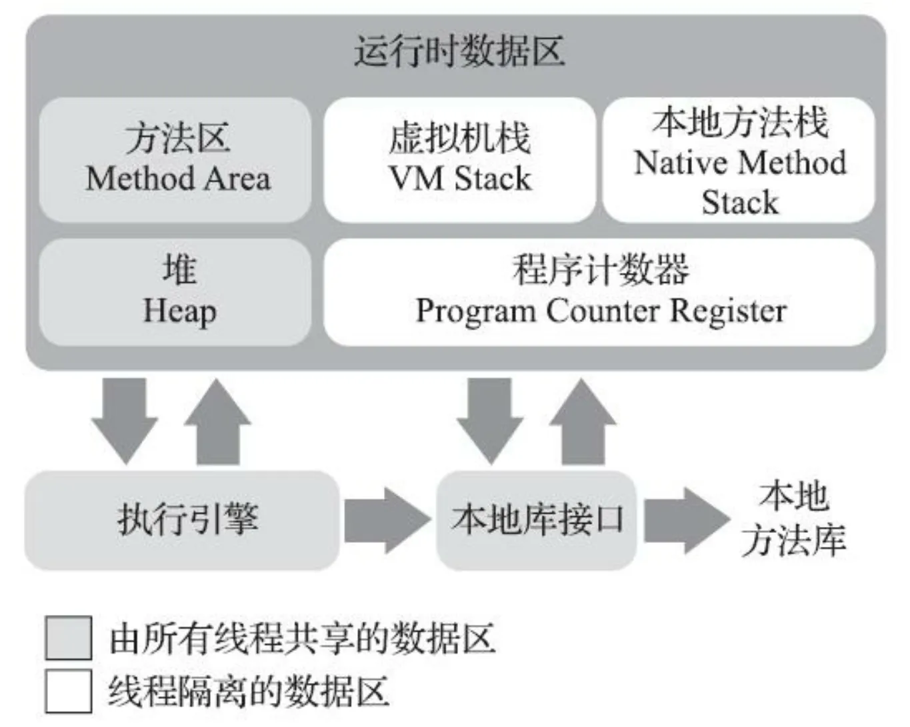
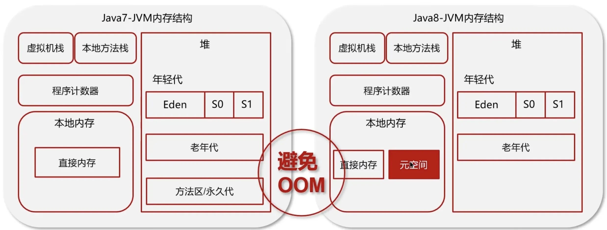

# 一 自动内存管理
## 1 Java内存区域与OOM异常
java虚拟机运行时的数据区

下面的图片更清晰，展示了方法区实现区域的变化，堆中的永久代 -> 本地内存的元空间

+ 程序计数器：线程私有，一个较小的内存空间，存放下一条执行的指令。
+ 虚拟机栈：线程私有，**生命周期与线程相同**，每个栈帧对应一个方法，栈帧用来存放**局部变量表，方法出口**等信息，每个方法从调用到执行完毕的过程都对应了一个栈帧入栈和出栈的过程。
    - 局部变量表：存放了编译期可以确定的基本数据类型，对象引用（并不等同与对象本身，可能是与此对象相关的地址）和`returnAddress`。这些数据类型在局部变量表里面以**局部变量槽**形式存储，局部变量表所需的内存空间（这里值的是**插槽数量**！）在编译期完成确定，方法运行时不会改变。
+ 本地方法栈：为本地方法服务，和虚拟机栈类似。
+ Java堆：**几乎所有**对象都在堆上分配（逃逸分析的**栈上分配，标量替换**，或者线程私有的**分配缓冲区TLAB**除外），堆是垃圾回收作用的地方。
    - 字符串常量池（jdk7以后，从 方法区/永久代 移动到堆中），`String.intern()`先看字符串常量池是否有对应的字符串，有就返回，没有则新建。
+ 方法区（永久代/堆->元空间/本地内存）：线程间共享，存储已被虚拟机加载的**类型信息，静态变量，常量，即时编译器编译后的代码缓存**等数据。
    - 运行时常量池：方法区的一部分，Class文件除了类的版本，字段，方法，接口等描述信息外，还有一项是**常量池表**，用于存放编译期生成的各种字面量与符号引用，将在**类加载后**放到运行时常量池中。
+ 直接内存：所有线程共享的地方。

## 2 HotSpot对象探秘
### 2.1 对象的分配
+ 当虚拟机遇到一条`new`指令时，会先检查这条指令能否在常量池定位到一个类的符号引用，并检查这个类是否已经被链接加载初始化了，如果没有则会先执行类加载过程。
+ **类加载检查**通过后，那么虚拟机会为新生对象完成内存分配，这里有两种方式，分别对应的不同情况：
    - 一，内存区域规则，采用**指针碰撞**，将指针在空闲区域移动对象大小的距离。
    - 二，内存区域不规则，采用**空闲列表**，在空闲内存找一块足够大的区域来分配。
+ 实际上对象创建是很频繁的行为，仅仅只修改指针朝向，在并发情况下不是线程安全的，比如正在给A分配内存，B又使用了原来的指针来分配内存，那么有两种可选方案：
    - 一，采用**CAS和失败重试**来保证原子性。
    - 二，在每个线程的堆中划分一小块**TLAB本地线程分配缓冲区**，分配缓冲区满了才需要同步锁定。
+ 内存分配完后，虚拟机会将分配到的内存空间（不包括对象头）都初始化为0值，如果使用了TLAB，那么也会在TLAB分配时进行。
+ 虚拟机会对**对象头**进行不同的设置，比如元数据，哈希码（真正调用`hashCode()`后），GC分代年龄等。

检查类加载->内存分配（两种方式：指针碰撞和空闲列表，两种方案：CAS+失败重试 和 TLAB）->设置对象头

### 2.2 对象的内存布局
在HotSpot虚拟机中，对象在堆中的内存分配分为三个区域：对象头，实例数据，对齐填充
+ 对象头，hotspot虚拟机的对象头包含两个部分：
    - 一是存储**对象自身运行时的数据**，比如哈希码，GC分代年龄，锁状态标志，线程持有的锁，偏向线程ID，偏向时间戳等。
        * 32位hotspot虚拟机标志位：01未锁定/可偏向，00轻量级锁定，10重量级锁定，11GC标记
    - 二是**类型指针**，对象指向它的类型元数据的指针，虚拟机通过这个指针来确定该对象是哪个类的实例，查找对象的元数据不一定要经过对象本身（具体见下一节-对象的访问定位）。
+ 实例数据，对象真正存储的有效信息。
+ 对齐填充，仅仅起到占位的作用。

### 2.3 对象的访问定位
Java程序通过栈上的reference数据操作栈上的具体对象，主流的访问方式有句柄和直接指针两种：
+ 句柄，Java堆中可能划分一块内存作为句柄池，reference中存储的就是对象的句柄地址，句柄中包含了对象的实例数据与类型数据。
+ 直接指针，reference直接指向对象的实例数据与类型数据，少一次间接访问的开销，但对象被移动时要改reference，而句柄不用改reference。

# 二 垃圾回收器与内存分配策略
## 1 判断对象是否死亡
+ 引用计数法
    - 占用额外空间，在对象中添加一个计数器，每当有一个地方引用他时，计数器加一。
    - 有**循环引用**的问题，导致虚拟机无法回收。
+ 可达性分析算法
    - 通过一些列GCRoot根对象，根据引用关系向下搜索，形成引用链，如果某个对象没有在引用链上，即不可达，则可以被回收。
    - 可作为GCRoot的对象有：
        * 虚拟机栈用引用的对象（线程正在使用的变量）
        * 方法区的类静态引用的对象（`static`）
        * 方法区中常量引用的对象（`static final`）
        * 本地方法栈中 JNI 引用的对象
        * 被同步锁`synchronized`持有的对象
        * 虚拟机内部引用的对象，包括基本数据类型对应的Class对象，异常对象，系统类加载器
        * 一句话，**两个栈里面的局部变量，方法区中的静态与常量，锁对象和jvm内部对象**。
+ 四种引用
    - 强引用，最传统的引用定义，例如`Object obj = new Object()`，只要强引用存在，垃圾回收器就不会回收。
    - 软引用，一些还有用但可被回收的对象，靠`SoftReference`实现，被软引用关联的对象，如果将要发生内存溢出，会对其进行垃圾回收。
    - 弱引用，非必须的对象，靠`WeakReference`实现垃圾回收时就会对其进行回收，无论内存是否足够。
    - 虚引用，唯一目的是为了在该对象被垃圾回收时收到一个通知。
+ 对象的自我拯救
    - 如果对象不在GCRoot链上，那么它会被放到F-Queue队列准备被执行`finalize()`方法，此方法**只会被执行一次**，那么对象可以在`finalize()`中尝试拯救自己，如果再次被放入F-Queue队列，并且`finalize()`方法早已被执行，那么它就不能再次拯救自己了，会被回收。
    - `finalize()`运行优先级很低，会导致内存释放延迟，而且后面被标记为废弃方法，更推荐使用`Cleaner`来释放资源。
+ 方法区垃圾回收
    - 废弃的常量，和堆类似。
    - 不再使用的类型，需要满足三个条件：所有实例已被回收，类加载器已被回收，类对象没有被引用。

## 2 垃圾回收算法
+ 分代收集理论
    - 弱分代收集理论：大多数对象都是朝生夕死的。
    - 强分代收集理论：熬过多次垃圾回收的对象越难以死亡。
    - 跨代引用假说：跨代引用对于同代引用来说占极少数。
+ 标记清除算法
    - 最基础的收集算法，先标记再清除。
    - 有两个缺点，一是执行效率不稳定，标记和清除效率都随着对象数量的增长而降低；二是容易造成内存空间碎片化，大对象如果拿不到足够的连续内存空间，会再触发一次标记清除。
+ 标记复制算法
    - 标记完毕后，将存活的对象移动到另一半，高效且没有内存碎片。
    - 问题是内存空间被划分为两半，只能利用一半，空间浪费太多。
+ 标记整理算法
    - 

